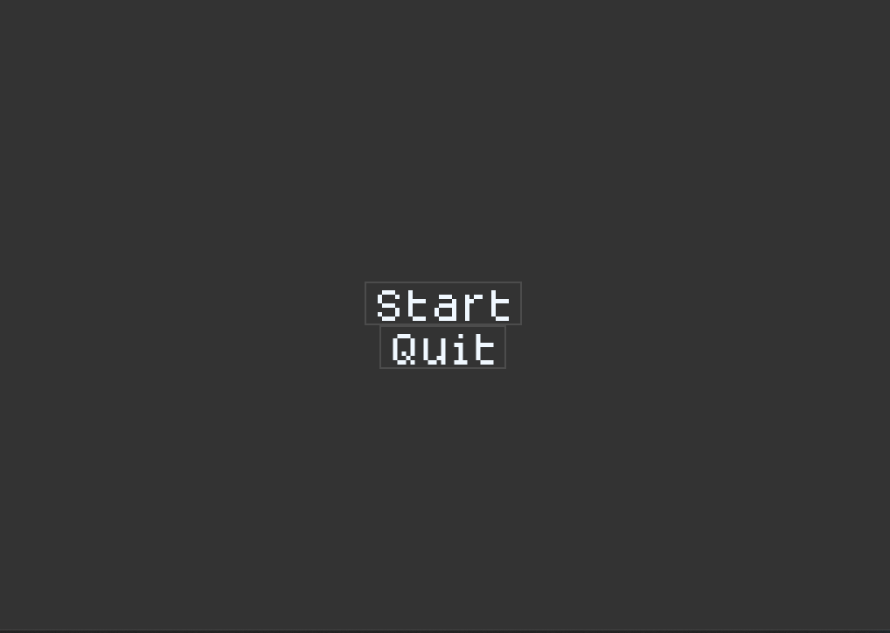
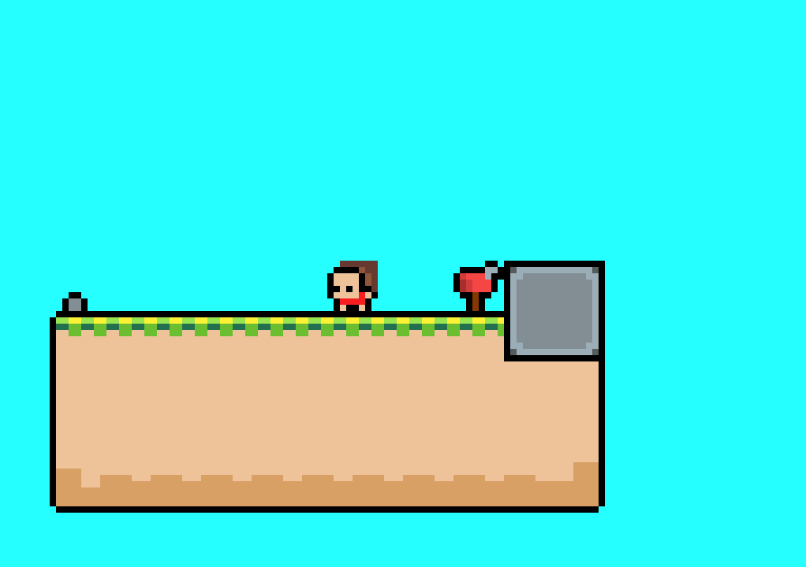
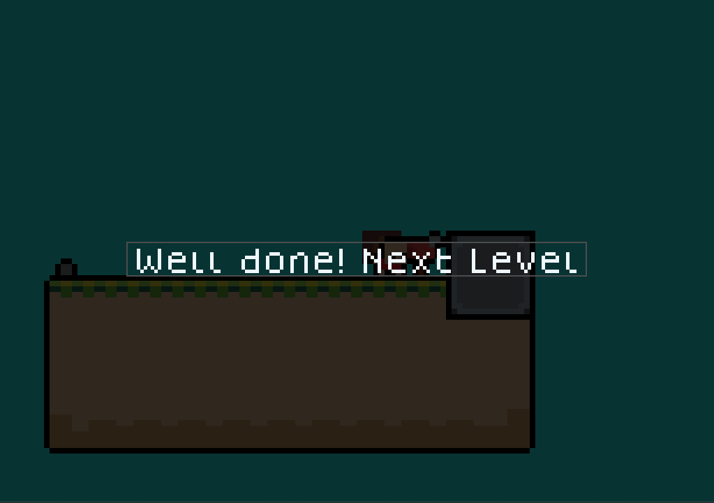
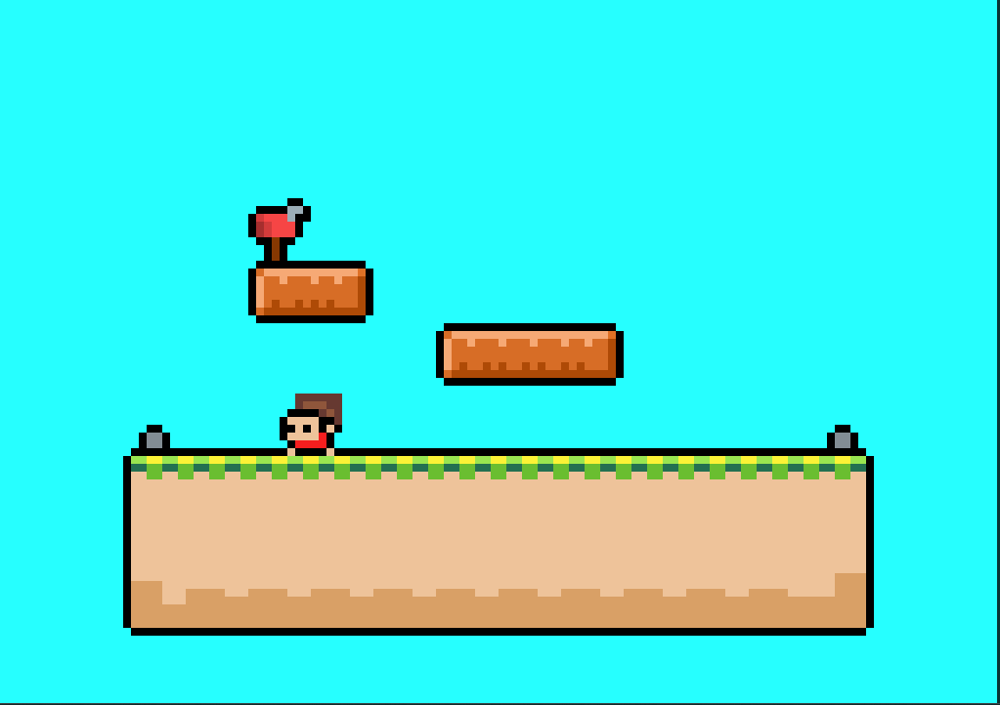

# Delivery
My fok of simple Delivery game...

My main goal is/was: explore this brave sample & plan to adaptation for UWP / W10M... :) 

## Screenshot(s)

## My 2 cents (status)
- Fast R.E.... 
- Project stopped on "non-UWP-compatible" Monigame.Framwork.Extended 3.8.xx...
- Some imGUI wrapper found...
- Deskop game assembled & tweaked a liittle (for better gameplay)
- Only 3 levels at now (so, yes, demo only)

## A few words (description) frow the author(original)
 "A game I am making for lumdum dare 53" - KittyKat

## Controls
- *Space* to jump
- Touchpanel (on "sensor notbooks") touch - jump too :)

## Goals (ToDo-s)
- Create Wiki
- Explore super-cool object-oriented programming
- Add more indicators / virtual gamepad, etc.
- Add more gameplay elements
- Improve AI
- Add story elements
- Add more sound effects for everything :)

## Reference(s)
- https://lioncatdevstudio.itch.io/you-got-a-package "project delivery", or you-got-a-package (original)
- [lioncatdevstudio](https://lioncatdevstudio.itch.io) lioncatdevstudioat itch.io (author of original Delivery)
- https://www.youtube.com/c/LioncatDevStudio

## ..
As is. No support. RnD only. DIY.

## .
[m][e] 2024

